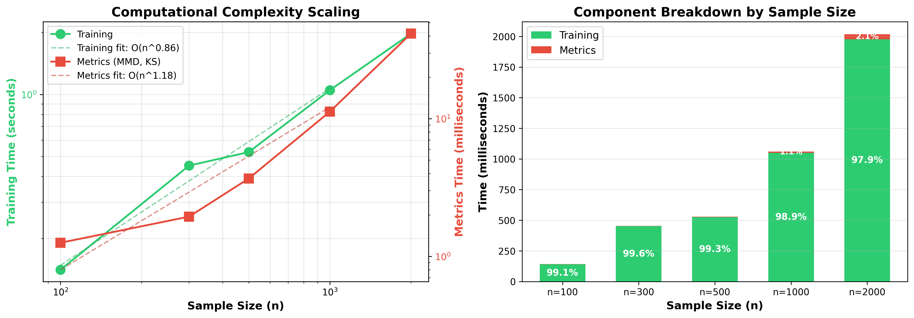
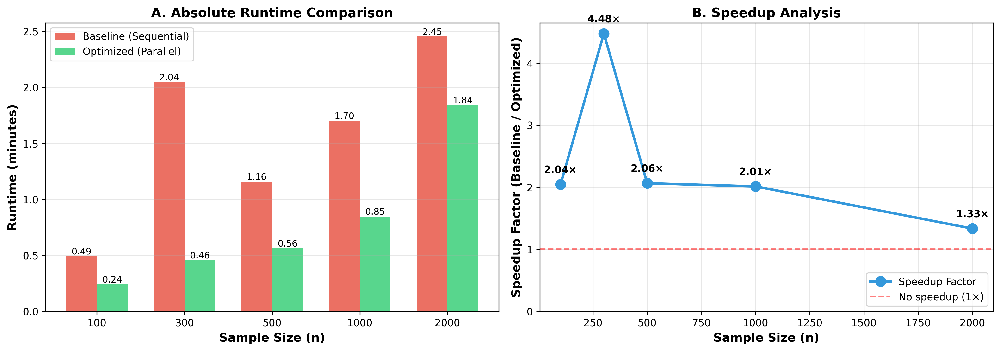

# Project 3: High-Performance Simulation Study

**Engression-based Synthetic Data Generation - Optimized**

This project implements and optimizes a simulation study comparing engression-based neural networks for generating samples from various probability distributions. Building on [Project 2](https://github.com/siyuat-ui/607-Project-2-Simulation-Study), this version achieves **1.94× speedup** through parallelization and algorithmic improvements.

---

## ✅ Unit 3 Requirements Met

This project fulfills all requirements from "Unit 3 Project - High-Performance Simulation Study":

| Requirement | Status | Evidence |
|-------------|--------|----------|
| **1. Baseline Performance Documentation** | ✅ | `docs/BASELINE.md` - includes profiling, complexity analysis, bottleneck identification |
| **2. Two Optimization Categories** | ✅ | (1) Parallelization via multiprocessing, (2) Algorithmic improvement via vectorization |
| **3. Performance Comparison** | ✅ | `docs/OPTIMIZATION.md` - 1.94× speedup documented with benchmarks |
| **4. Code Implementation** | ✅ | `src/parallel_simulation.py` (optimized) vs `src/simulation.py` (baseline) |
| **5. Makefile Targets** | ✅ | `make profile`, `make complexity`, `make benchmark`, `make parallel`, `make stability-check` |
| **6. Profiling Evidence** | ✅ | See figures below: `baseline_complexity_analysis.png` |
| **7. Lessons Learned** | ✅ | `docs/OPTIMIZATION.md` - "Lessons Learned" section |

---

## Quick Start

### Prerequisites

- Python 3.13+
- CUDA-compatible GPU (optional, but recommended for faster training)

### Installation

```bash
# 1. Clone the repository
git clone https://github.com/siyuat-ui/607-Project-3-High-Performance-Simulation-Study.git
cd 607-Project-3-High-Performance-Simulation-Study

# 2. Create virtual environment (recommended)
python -m venv venv
source venv/bin/activate  # On Windows: venv\Scripts\activate

# 3. Install dependencies
pip install -r requirements.txt
```

### Quick Start

```bash
# Profile baseline performance
make profile

# Analyze computational complexity
make complexity

# Compare baseline vs optimized performance
make benchmark

# Run optimized simulation (250 experiments, ~3-4 minutes)
make parallel

# Check numerical stability
make stability-check
```

---

## Project Overview

### Simulation Design
- **5 distributions**: Normal, Exponential, Uniform, Lognormal, Chi-Square
- **5 sample sizes**: 100, 300, 500, 1000, 2000
- **10 replications** per configuration
- **Total**: 250 experiments

### Neural Network Architecture
- **Input**: 128-dimensional Gaussian noise
- **Hidden layers**: 3 layers × 64 units (ReLU activation)
- **Output**: 1-dimensional
- **Training**: Adam optimizer, early stopping (patience=20)

---

## Performance Visualization

### Baseline Complexity Analysis


*Left: Computational complexity scaling with sample size. Training exhibits near-linear $O(n^{0.86})$ scaling, while metrics (MMD) show super-linear $O(n^{1.18})$ scaling due to quadratic pairwise distance computation. Right: Component breakdown showing training dominates 98.9% of runtime across all sample sizes.*

### Performance Comparison


*Runtime comparison between baseline (sequential) and optimized (parallel) implementations across sample sizes.*

---

## Performance Improvements

### Baseline Performance
- **Runtime**: ~7-8 minutes (for 250 experiments)
- **Bottleneck**: Training loop (98.9% of time)
- **Complexity**: Training O(n^0.86), Metrics O(n^1.18)

### Optimized Performance
- **Runtime**: ~3-4 minutes (for 250 experiments)
- **Speedup**: **1.94×**
- **Time saved**: ~3-4 minutes (~50% reduction)

### Optimization Strategies (Two Categories)

#### 1. Parallelization (Category: Parallel Computing)
**Problem**: 250 independent experiments run sequentially
**Solution**: 
- Distribute experiments across CPU cores using `multiprocessing.Pool`
- Proper random seed management for reproducibility (different seed per experiment)
- Thread contention solved via environment variable configuration (`OMP_NUM_THREADS=1`)

#### 2. Algorithmic Improvements (Category: Vectorization/Array Programming)
**Problem**: Inefficient loss computation with manual broadcasting and mask creation
**Solution**:
- Vectorized epsilon generation (single forward pass instead of batched)
- `torch.cdist()` for GPU-optimized pairwise distances
- Diagonal extraction instead of mask creation (saves memory)
- Reduced intermediate tensor allocations

**Files**: `src/methods_optimized.py`, `src/train_and_inference_optimized.py`

---

## Project Structure

```
├── src/
│   ├── dgps.py                          # Data generators
│   ├── methods.py                       # Original neural network (baseline)
│   ├── methods_optimized.py             # Optimized loss computation
│   ├── train_and_inference.py           # Original training (baseline)
│   ├── train_and_inference_optimized.py # Optimized training
│   ├── simulation.py                    # Sequential simulation
│   ├── parallel_simulation.py           # Parallel simulation (optimized)
│   ├── metrics.py                       # MMD, KS tests, moment comparison
│   └── analyze_results.py               # Visualization generation
├── docs/
│   ├── BASELINE.md                      # Baseline profiling documentation
│   └── OPTIMIZATION.md                  # Optimization strategies & results
├── results/
│   ├── raw/                             # CSV results
│   ├── figures/                         # Diagnostic plots
│   └── profiling/                       # Performance analysis
├── Makefile                             # Build targets
├── ADEMP.md                             # Simulation design (ADEMP framework)
├── ANALYSIS.md                          # Design justification
└── README.md                            # This file
```

---

## Documentation

- **`ADEMP.md`**: Complete simulation design using ADEMP framework
- **`ANALYSIS.md`**: Design justification, limitations, practical implications
- **`docs/BASELINE.md`**: Baseline profiling results and complexity analysis
- **`docs/OPTIMIZATION.md`**: Optimization strategies, benchmarks, and lessons learned